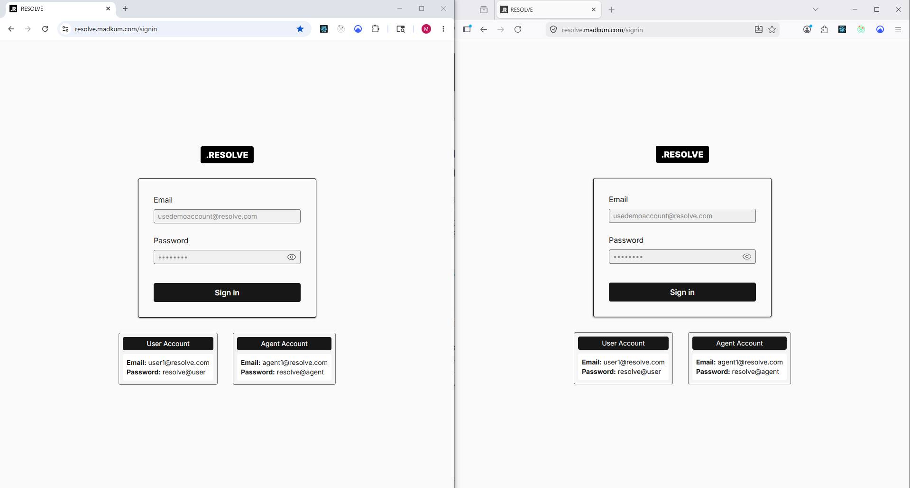
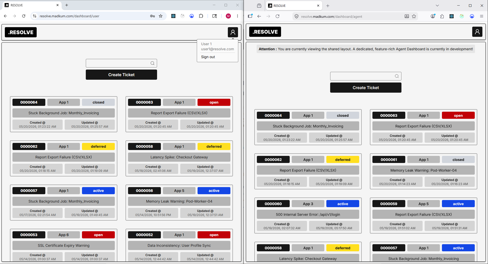
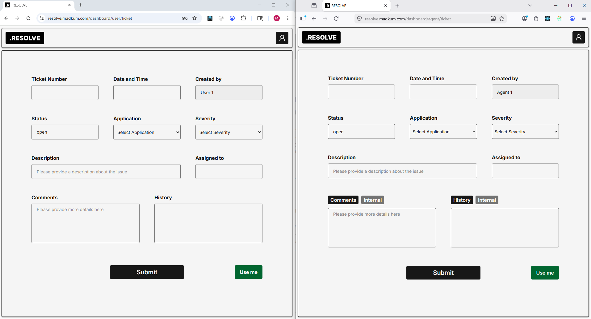
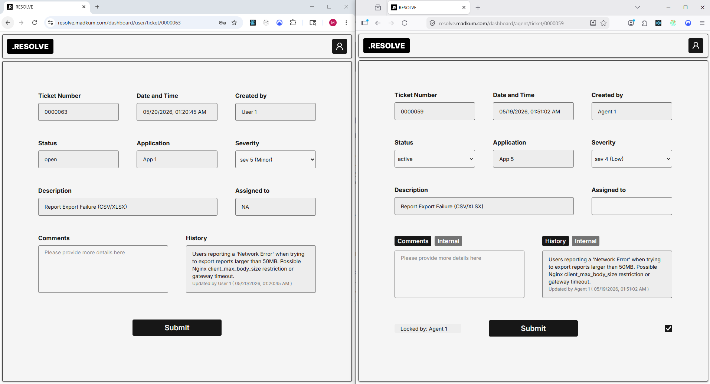
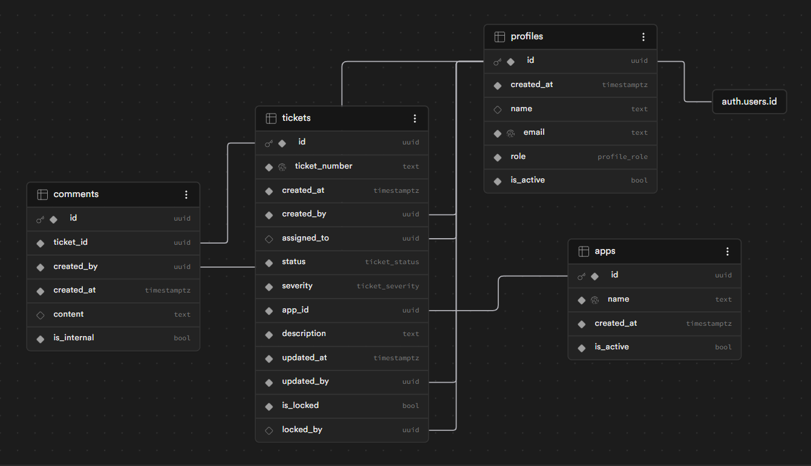

# .RESOLVE | Internal Ticketing Dashboard

A role-based internal ticketing dashboard to create, manage, track, and resolve user issues efficiently. Built with a modern front-end stack and Backend-as-a-Service.

**Live Demo:** [https://resolve.madkum.com/]

https://github.com/user-attachments/assets/610d595b-2704-455a-94cb-eacfabba5ef1

## Tech Stack

- **Front-end:** React, TypeScript, Tailwind CSS
- **State Management:** Context API, Zustand, TanStack Query
- **Backend-as-a-Service:** Supabase (PL/pgSQL, Realtime, RPC )

## Features

### Frontend Engineering

#### **Role-Based Dashboard UI**

- **User View:** A clean minimal setup to create new tickets, track real-time resolution status and view historical ticket logs.
- **Agent View:** An agent can create tickets, while also extending to lock or claim tickets, update status, record public and internal comments.
- **Sorting and Filtering**: A fetaure-rich dedicated agent dashboard is currently in development where the agent can sort and filter tickets across multiple columns.

#### **Performance & State Management**

- **UI State:** Managed auth state like logged in profile details via **React Context API** and **Zustand** for lightweight, toaster UI updates.
- **Server State & Caching:** Powered by **TanStack Query** for automatic re-fetching, and zero-latency UI transitions when updating tickets.
- **Real-time Updates:** Integrated **Realtime** by supabase for instant updates across individual ticket view and also centralized tickets queue.

### Backend Engineering

The entire business logic is decentralized away from the client-side and locked within the database layer.

#### **Profile Administration & Access Control**

- **Row-Level Security (RLS):** Agents can read/update all tickets in the queue, while Users are strictly limited to viewing and interacting only with the tickets they created.
- **Administrative Guardrails:** Profile's active status can be toggled in the custom profiles table to block unauthorized or rejected accounts from signing in entirely.

#### **Secure Data Isolation & Workflows**

- **Front-end Constraints (Supabase RPC):** Ticket creation and updates are exclusively handled via Stored Procedures (**Remote Procedure Calls**) preventing from overriding the intended data structure or manipulating parameters through client-side code.
- **Database Triggers & Functions:** Implemented automated Postgres triggers to strictly enforce ticket lifecycle rules. For example, a trigger validates that a ticket's status flow is sequential, preventing a ticket from moving directly from "Open" to "Resolved".

## Authors

- LinkedIn: [@madhankumarr150896](https://www.linkedin.com/in/madhankumarr150896/)
- Mail: madhankumar150896@outlook.com

## Technical Challenge

### Breaking RLS Infinite Recursion via Security Definer Functions

**The Challenge:** While implementing strict Row-Level Security (RLS) policies on the `tickets` table, I ran into infinite recursion loop. To determine if a user had permission to view a ticket or to insert comments, the RLS policy needed to cross-reference the profile's role. However, querying the data to verify the role repeatedly re-triggered the same RLS policy, resulting in a call-stack timeout and broken data fetching.

**The Solution:** I isolated the role-verification logic into a dedicated PostgreSQL helper function configured as a **`SECURITY DEFINER`**.

- By setting the function to execute with the privileges of the user who **created** the function rather than the invoking user, I safely bypassed the RLS evaluation layer for that single check.
- To prevent security vulnerabilities like privilege escalation, I explicitly set the function's `search_path` to public.

## Screenshots

### Frontend

### Backend

