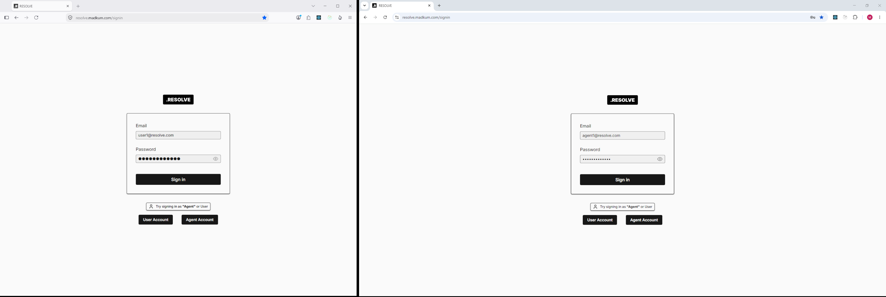
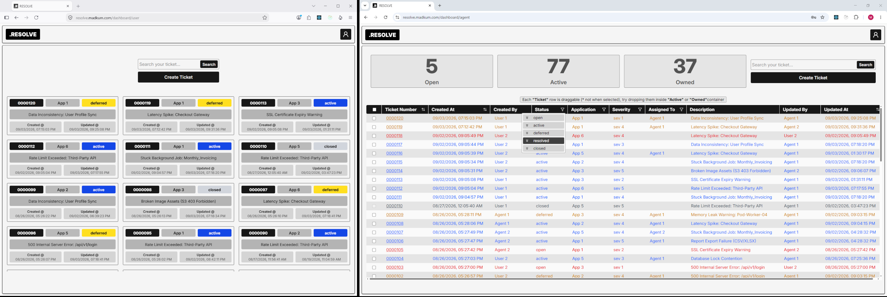
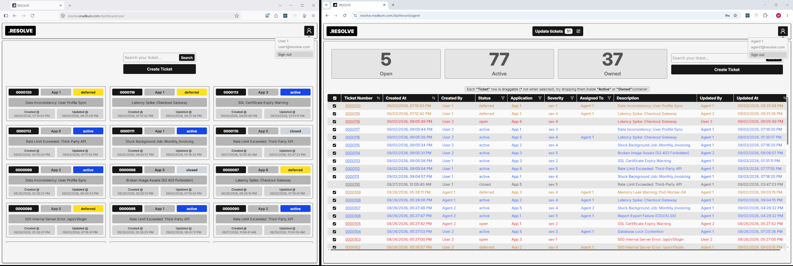
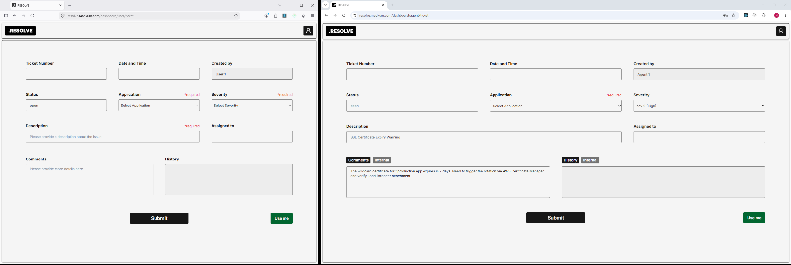
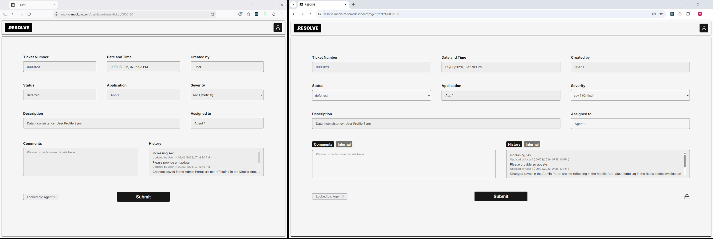
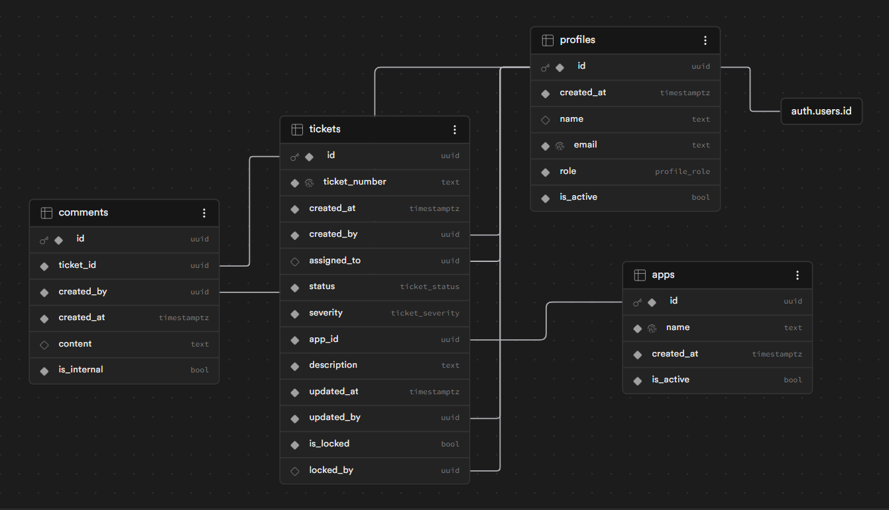

# .RESOLVE | Internal Ticketing Dashboard

An internal ticket management application that enables ticket creation, status tracking and end-to-end lifecycle management with serverless architecture utilizing Supabase (Backend-as-a-Service), featuring Role-Based Access Control (RBAC).

**Live Demo:** [https://resolve.madkum.com/]

https://github.com/user-attachments/assets/610d595b-2704-455a-94cb-eacfabba5ef1

## Tech Stack

- **Front-end:** React, TypeScript, Tailwind CSS
- **State Management:** Context API, Zustand, TanStack Query
- **Backend-as-a-Service:** Supabase (PL/pgSQL, Realtime, RPC )

## Features

### Frontend Engineering

#### **Role-Based UI**

- **User View:** A clean minimal UI to create tickets, track real-time resolution and view historical ticket logs.
- **Agent View:** A tabular UI for agent specific dashboard with **Drag and Drop** feature, **Multiple ticket Update**,while extending to lock or claim tickets and record internal comments.
- **Sorting and Filtering**: Column specific **Sort and Filter** through custom cursor with keyset pagination paired with **infinite scroll**.

#### **Performance & State Management**

- **UI State:** Managed auth state like logged in profile details via **React Context API** and **Zustand** for multiple ticket update and toaster UI updates.
- **Server State & Caching:** Powered by **TanStack Query** for efficient caching, re-fetching and zero-latency UI transitions.
- **Real-time Updates:** Integrated **Realtime** by supabase for instant updates across individual ticket view and centralized tickets queue.

### Backend Engineering

The business logic is decentralized away from the client-side and devised within the database layer.

#### **Profile Administration & Access Control**

- **Row-Level Security (RLS):** Agents can read/update all tickets in the queue, while Users are limited to read/update only the tickets they created.
- **Administrative Guardrails:** Profile's active status can be toggled in the profiles table to block unauthorized signin and setup a trigger to check the profile's status while signing in.

#### **Secure Data Isolation & Workflows**

- **Front-end Constraints (Supabase RPC):** Ticket creation and updates are handled through **Remote Procedure Calls** preventing from overriding the intended data structure or parameters through client-side code.
- **Database Triggers & Functions:** Implemented Postgres triggers to strictly enforce business logic, such as to validate if a ticket's status flow is sequential, preventing a ticket from moving directly from "Open" to "Resolved".

## Authors

- LinkedIn: [@madhankumarr150896](https://www.linkedin.com/in/madhankumarr150896/)
- Mail: madhankumar150896@outlook.com

## Technical Challenge

### Breaking RLS Infinite Recursion via Security Definer Functions

**The Challenge:** While implementing strict Row-Level Security (RLS) policies on the `tickets` table, I ran into infinite recursion loop. To determine if a user had permission to view a ticket or to insert comments, the RLS policy needed to cross-reference the profile's role. However, querying the data to verify the role repeatedly re-triggered the same RLS policy, resulting in a call-stack timeout and broken data fetching.

**The Solution:** I isolated the role-verification logic into a dedicated PostgreSQL helper function configured as a **`SECURITY DEFINER`**.

- By setting the function to execute with the privileges of the user who **created** the function rather than the invoking user, I safely bypassed the RLS evaluation layer for that check.

## Screenshots

### Frontend

### Backend

